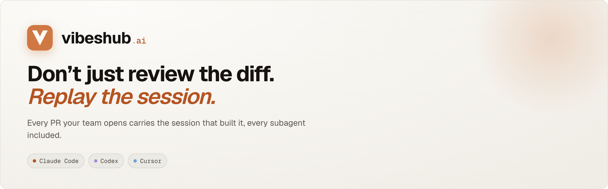
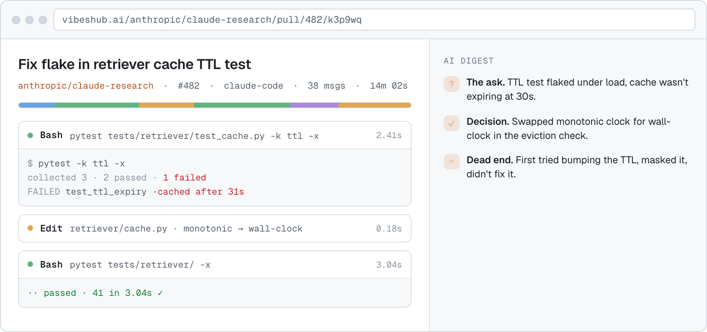

<!-- HERO BANNER -->
<p align="center">
  <a href="https://vibeshub.ai">
    <picture>
      <source media="(prefers-color-scheme: dark)" srcset="assets/brand/readme-banner-dark.png">
      
    </picture>
  </a>
</p>

<!-- BADGES -->
<p align="center">
  <a href="https://vibeshub.ai"></a>
  
  
  
  
</p>

<!-- PITCH -->
<p align="center">
A public viewer for AI coding traces, attached to the pull requests they produced. Each platform's plugin uploads the session transcript on every PR, and a backend summary agent distills it into a readable <b>digest</b>: the ask, key decisions, dead ends, and chapter anchors.
</p>

<p align="center">
Traces are portable, not just viewable: hand off a live session from Claude Code to Codex and keep going there, or pull a trace back down into either CLI and resume it. See <a href="#trace-porting">Trace porting</a>.
</p>

<!-- PRODUCT SCREENSHOT -->
<p align="center">
  <a href="https://vibeshub.ai">
    <picture>
      <source media="(prefers-color-scheme: dark)" srcset="assets/screenshots/trace-viewer-dark.png">
      
    </picture>
  </a>
</p>
<p align="center"><sub><i>The trace viewer: hero, AI digest, chapter jumps, collapsible tool cards.</i></sub></p>

## Quick start

Install the plugin in your AI coding tool. The next time you run `gh pr create` (or push a branch that already has a PR), your trace is uploaded and linked automatically.

```
/plugin marketplace add vibeshub/vibeshub
/plugin install vibeshub@vibeshub
# Codex: same package, auto-detected at runtime
# Cursor: install vibeshub from the Cursor marketplace
```

## Supported platforms

| Platform | Install |
|----------|---------|
| Claude Code | Marketplace plugin, see [plugins/cli/README.md](plugins/cli/README.md#install) |
| Codex | Marketplace plugin, same package, auto-detected at runtime |
| Cursor | Marketplace plugin: install **vibeshub** from the Cursor marketplace ([vibeshub/vibeshub-cursor](https://github.com/vibeshub/vibeshub-cursor)) |

All three share the same upload pipeline, redaction, and PR comment logic. Platform-specific hook surfaces and transcript paths are documented in [plugins/cli/README.md](plugins/cli/README.md).

## How it works

No new workflow, no new identity. Run `gh pr create` inside an AI coding session and the plugin does the rest.

<table>
<tr>
<td width="33%" valign="top">

`01 · HOOK`

**Hook captures the session.**

A `PostToolUse` hook fires when `gh pr create`, `gh pr edit`, or `git push` finishes and finds the matching transcript.

`~/.claude/projects/…/*.jsonl`

</td>
<td width="33%" valign="top">

`02 · REDACT`

**Redact, twice.**

Client strips secret shapes (keys, JWTs, env assignments). Server runs the same pass again.

`client + server`

</td>
<td width="33%" valign="top">

`03 · PUBLISH`

**Linked from the PR.**

vibeshub stores the trace, runs the digest agent, and a single bot comment lands on the PR.

`vibeshub.ai/{owner}/{repo}/pull/{n}`

</td>
</tr>
</table>

The full ten-step pipeline (digest agent, private-repo gating, web upload) is in [the architecture doc](docs/architecture.md), kept out of the hero so the README stays scannable.

## Trace porting

A trace is not just a replay. A trace can come back down as a live session and continue from where it stopped, moving between Claude Code and Codex in either direction.

- **Claude Code → Codex:** `/handoff` uploads this session, places the converted Codex session on this machine, and prints the exact `codex resume <id>` that continues the same conversation. Edit, `/handoff`, quit, paste one command, keep going in Codex.
- **Back into Claude Code:** `/import <trace-url-or-id> [--checkout]` (run in Claude Code) pulls a vibeshub trace, including one handed off to or recorded in Codex, back down as a resumable session in the current project.
- **Either direction:** `/import-trace <trace-url-or-id> --to codex|claude` is the generic form, available in both CLIs (`/vibeshub:import-trace` in Codex).

Conversion between Claude Code and Codex is resume-grade in both directions; provider-encrypted reasoning cannot cross over, and Cursor traces can be ported to Codex but have no Claude Code target. Flags and caveats are in [plugins/cli/README.md](plugins/cli/README.md#manual-import-command).

## Project reference

<details>
<summary><b>Repo layout</b></summary>

```
vibeshub/
├── plugins/
│   ├── cli/            # Claude Code + Codex + Cursor: hooks + slash commands
│   │                   # (/share-trace, /handoff, /import, /import-trace);
│   │                   # bundles the vibeshub_client library (redaction, upload, gh-comment)
│   └── README.md       # how to add a new platform plugin
├── webapp/
│   ├── backend/        # FastAPI + SQLAlchemy + Alembic; serves SPA from frontend_dist/
│   │                   # GitHub OAuth, session cookies, repo-access gating, blob storage
│   │                   # agents/digest: trace summary agent + chapter anchors
│   └── frontend/       # React + Vite SPA; build copies dist/ → backend/frontend_dist/
│                       # Landing, /home, /vibeviewer, /privacy, /faq, /contact, /:owner,
│                       # /:owner/:repo, /:owner/:repo/pull/:number[/:shortId], /t/:shortId viewer
├── cursor-plugin/      # generated Cursor plugin snapshot, mirrored to vibeshub/vibeshub-cursor
├── scripts/            # sync-cursor-plugin.py, regenerates that snapshot
├── deploy/azure/       # Dockerfile + deploy.sh + Portal/CLI walkthroughs
└── docs/superpowers/   # design spec + implementation plans
```

Per-component docs:

- [webapp/backend/README.md](webapp/backend/README.md), env vars, OAuth setup, local run, tests
- [webapp/backend/app/agents/digest/README.md](webapp/backend/app/agents/digest/README.md), summary agent flow, OpenAI env vars, degradation modes, operations queries
- [webapp/frontend/README.md](webapp/frontend/README.md), routes, dev server, build, tests
- [plugins/cli/README.md](plugins/cli/README.md), install, hook config, slash commands

**Versioning:** one product version for plugin + webapp. Source of truth is
`PLUGIN_VERSION` in [`plugins/cli/vibeshub_client/version.py`](plugins/cli/vibeshub_client/version.py);
mirrors (Claude/Codex manifests, plugin + backend `pyproject.toml`, frontend
`package.json`, FastAPI metadata, this README badge) are kept in lockstep by
test. Cursor's `plugin.json` is generated from the same value; see
[docs/cursor-release.md](docs/cursor-release.md).

</details>

<details>
<summary><b>Local development</b></summary>

```bash
# One-time: repo-root venv (Python 3.12–3.13; gitignored as env/)
python3.13 -m venv env   # or python3.12 -m venv env
./env/bin/pip install -e "webapp/backend[dev]"

# Backend (FastAPI on :8000), in-memory SQLite, /tmp blob dir
VIBESHUB_COOKIE_SECURE=false ./env/bin/uvicorn app.main:app --reload --app-dir webapp/backend

# Frontend (Vite on :5173), proxies /api → backend:8000
cd webapp/frontend && npm install && npm run dev
```

The plugin hooks run on the user's `python3` (3.9+). The backend requires 3.12–3.13.

`VIBESHUB_COOKIE_SECURE=false` is required locally: with the production default (`true`), the app refuses to boot unless `VIBESHUB_SESSION_SECRET` and `VIBESHUB_TOKEN_ENCRYPTION_KEY` are set. GitHub sign-in itself stays optional; its routes return `503 oauth_not_configured` until the OAuth vars are set. See the [backend README](webapp/backend/README.md) for the full list.

</details>

<details>
<summary><b>Deploying</b></summary>

Azure Container Apps + Postgres Flexible Server + Blob Storage with managed identity. See [deploy/azure/README.md](deploy/azure/README.md) (CLI) or [deploy/azure/README-portal.md](deploy/azure/README-portal.md) (Portal walkthrough).

</details>
